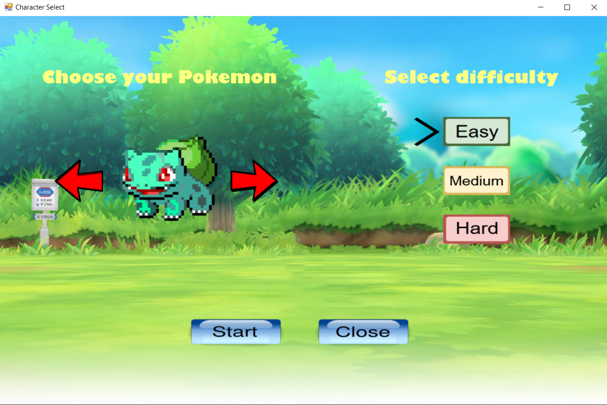
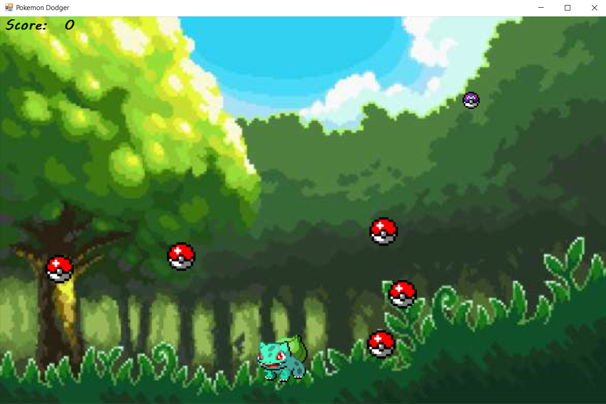

# Pokemon Dodger

## 1) Опис на апликацијата  
„Pokemon Dodger“ е игра каде што играчот со движење на својот карактер (*Покемон*) во дводимензионален простор цели кон избегнување на што е можно повеќе црвени покемон топки 
наречени *Покетопки*. Со секоја избегната Покетопка играчот освојува еден поен а со секоја собрана виолетова покемон топка, *Мастертопка*, играчот освојува три поени. Играта 
завршува кога играчот ќе се судри со Покетопка.  

## 2) Упатство  
### 2.1) Почетен прозорец  

Со стартување на играта се отвара почетниот прозорец. Со притиснување на копчињата „стрелка лево“ и „стрелка десно“ од тастатурата играчот може да го менува Покемонот со кој 
сака да ја игра играта. Менувањето на Покемон може да се изврши и со притиснување на левото копче на маусот на левата црвена стрелка и на десната црвена стрелка прикажани 
во рамки на играта. Играчот може да ја одбере и тежината на нивото на играта кое може да биде:   
- лесно ниво (Easy)  
- средно тешко ниво (Medium) 
- тешко ниво (Hard)

Доколку играчот не одбере ниво, стандардно се бира лесното ниво. Доколку играчот одбере лесно ниво, тој ќе избегнува 5 Покетопки истовремено, а за средно тешко и тешко ниво ќе избегнува 10 и 15 
Покетопки соодветно. Откако играчот ќе го избере посакуваниот Покемон и ќе ја избере посакуваната тежина на играта, со притиснување на копчето Start играта ќе започне. 
Доколку играчот се предомислил и не сака да ја игра играта, со притиснување на копчето Close или пак со притиснување на X на прозорецот ќе се стопира играта.
 

 

&nbsp;&nbsp;&nbsp;&nbsp;&nbsp;&nbsp;&nbsp;&nbsp;&nbsp;&nbsp;&nbsp;&nbsp;&nbsp;&nbsp;&nbsp;
(сл1. Приказ на почетниот прозорец на играта)
 

### 2.2) Играње на играта  

По притиснување на копчето Start од почетниот прозорец, се отвора нов прозорец каде што започнува играта. Покемонот кој го избрал играчот се наоѓа во долниот централен дел а 
Покетопките со различна брзина но со исто време на почеток започнуваат да паѓаат од горниот дел. Мастертопката е помала во димензии и се движи побавно. Откатко една Покетопка ќе го
одмине Покемонот (играчот успешно ја избегнува), резултатот кој се наоѓа во горниот лев агол се зголемува за 1 поен. Играчот ги избегнува Покетопките со притиснување на копчињата:
„стрелка горе“, „стрелка долу“, „стрелка лево“ и „стрелка десно“ за придвижување на Покемонот во некоја од четирите насоки соодветно.  

 

&nbsp;&nbsp;&nbsp;&nbsp;&nbsp;&nbsp;&nbsp;&nbsp;&nbsp;&nbsp;&nbsp;&nbsp;&nbsp;&nbsp;
(сл2. Приказ на прозорецот во кој се игра играта)
 

### 2.3) Излезен прозорец  

ОЛГИТСЕ ПРЕВЗЕМИ ОД ТУКА ХЕХЕ
